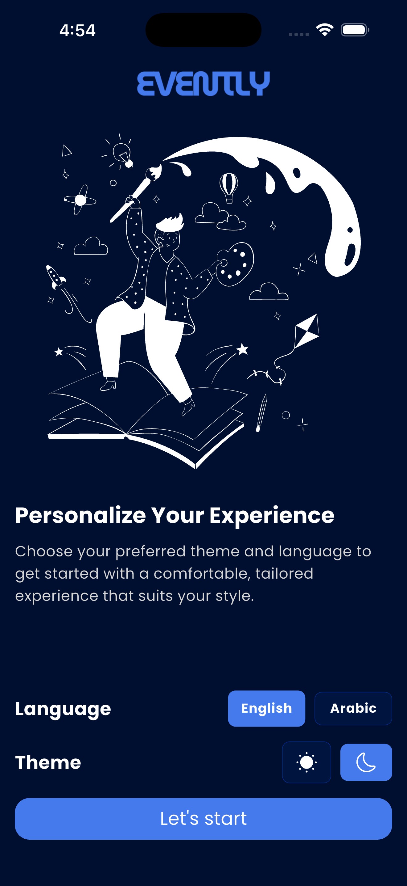

# 🌟 Evently App

> 🚧 **Note:** This project is currently under active development (Work In Progress). New features, UI enhancements, and functionalities are being pushed regularly!

**Evently** is a modern, intuitive event discovery and planning application built with Flutter. It empowers users to find events that inspire them, seamlessly plan their own gatherings, and connect with friends to share unforgettable moments.

---

## ✨ Features & Technical Achievements

### 1. 🎨 Global Theming & Dynamic UI
* **Dynamic Theme Toggling:** Seamless switching between **Light** and **Dark** modes utilizing a robust, centralized `AppTheme` architecture (`colorScheme`, `inputDecorationTheme`).
* **Smart UI Components:** Custom built, theme-aware widgets (e.g., `ToggleSwitch`, `CustomBackButton`, `EventCard`) that adapt their borders, backgrounds, images, and text colors dynamically based on the active theme.
* **Dynamic SVG Coloring:** Implemented seamless theme transitions for vector graphics using `ColorFilter` and `BlendMode.srcIn` to avoid pixelation and hardcoded colors.
* **Custom Typography:** Integrated and properly configured the **Poppins** font family globally across the application for a premium feel.

### 2. 🧠 Advanced State & Memory Management
* **Clean Architecture:** Strictly separated the UI (Presentation) from Business Logic using `StatelessWidget` and `Provider` (`ChangeNotifier`).
* **Provider Scoping & Optimization:** Strategically placed local providers (e.g., `AuthProvider`, `HomeProvider`) specifically within the widget trees that require them—keeping the global `main.dart` clean to ensure optimal Memory Garbage Collection and Separation of Concerns.
* **Multi-Provider Syncing:** Efficiently combined multiple states using `Consumer2` to create seamless UI updates without rebuilding the entire screen.

### 3. 💾 Local Data Persistence & Smart Routing
* **Persistent State:** Implemented `shared_preferences` to save user settings securely on the device's local storage.
* **Smart Splash Screen (Traffic Router):** Developed a dynamic `SplashScreen` that asynchronously checks the local storage to route the user instantly to the `StartScreen`, `LogInScreen`, or `HomeTab` based on their onboarding and authentication status.
* **Theme Memory:** Synced the `SettingsProvider` with local storage to automatically fetch and apply the user's preferred theme (Light/Dark) upon app launch, before the UI even renders.

### 4. 📅 Dynamic Event Creation & Filtering
* **Interactive Pickers:** Integrated native `showDatePicker` and `showTimePicker`, handling asynchronous data collection and merging them into unified `DateTime` models.
* **Real-time List Filtering:** Developed a dynamic Home screen that instantly filters and updates the `ListView` based on the selected category chip using encapsulated Provider logic.

### 5. 🌐 Clean Code & Localization Ready
* **Resource Managers:** Extracted all hardcoded texts and assets into `StringsManager` and `AssetsManager` to enforce DRY principles and prepare the app for seamless multi-language support (English/Arabic).
* **Responsive Layout:** Carefully calculated dimensions using custom `SizeManager` and dynamic paddings to ensure the UI looks flawless and prevents overflow on all screen sizes.

---

## 📱 Screenshots

*(Note: These are initial previews. UI is subject to enhancements as development continues.)*

| Splash & Routing | Start Screen (Light) | Start Screen (Dark) |
|:---:|:---:|:---:|
|  |  |  |

| Onboarding 1 | Onboarding 2 | Onboarding 3 |
|:---:|:---:|:---:|
|  |  |  |

---

## 🛠️ Tech Stack & Architecture

* **Framework:** [Flutter](https://flutter.dev/)
* **Language:** Dart
* **State Management:** [Provider](https://pub.dev/packages/provider)
* **Key Packages:** `smooth_page_indicator`, `flutter_svg`, `intl`, `shared_preferences`
* **Architecture:** Feature-first modular approach (`core/`, `features/`, `providers/`) emphasizing **Separation of Concerns**, **DRY**, and **Clean Code** principles.

---

## 🚀 Getting Started

To get a local copy up and running, follow these simple steps:

### Prerequisites
* Flutter SDK (Latest stable version)
* Dart SDK
* An IDE (VS Code, Android Studio, etc.)

### Installation
1. Clone the repo:
   ```sh
   git clone [https://github.com/saidelhadidi/evently_app.git](https://github.com/saidelhadidi/evently_app.git)
## 👨‍💻 Author

**Said Elhadidi** *GDGoC Egypt Facilitator & Mobile Developer* [LinkedIn](https://www.linkedin.com/in/saidelhadidi/) | [GitHub](https://github.com/saidelhadidi)

---
