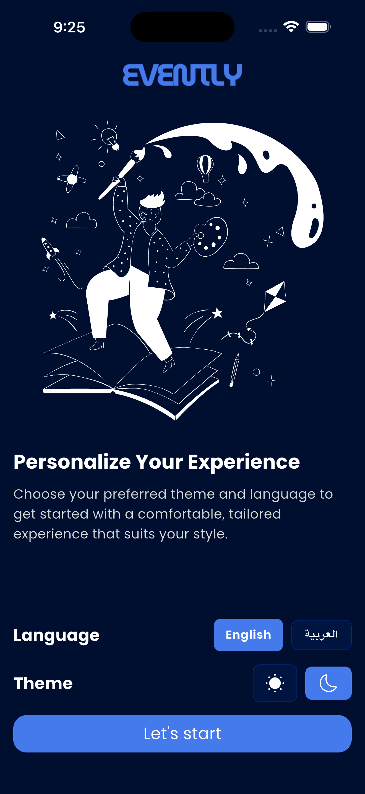
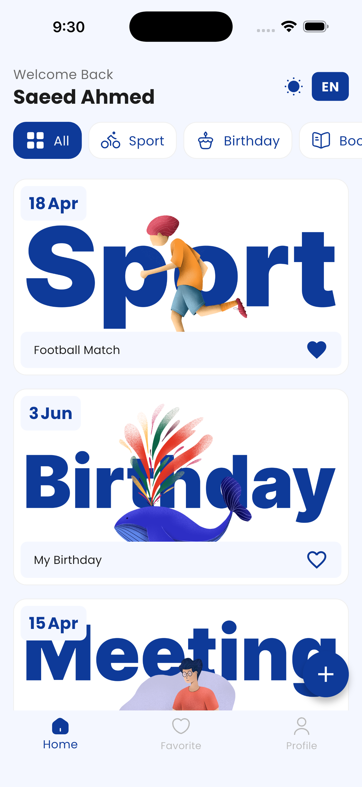
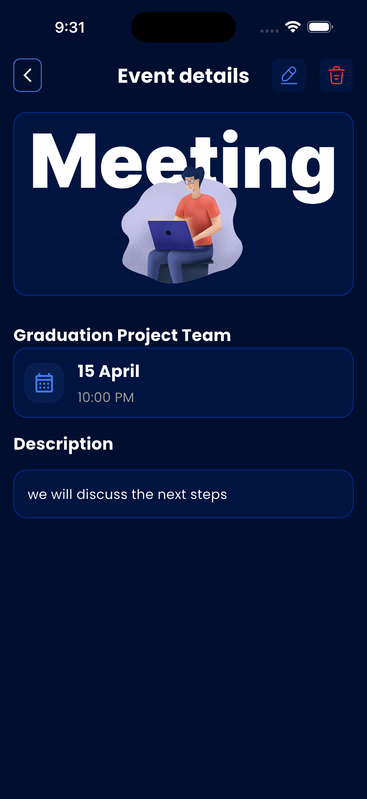
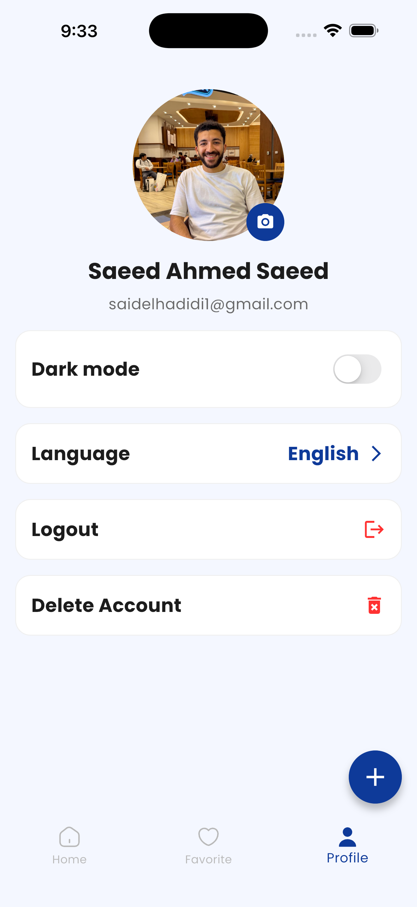

# 🌟 Evently App

> 🚀 **Note:** This project has evolved from a WIP to a fully functional, scalable application. It features real-time cloud syncing, robust security rules, and a clean architectural foundation.

**Evently** is a modern, intuitive event discovery and planning application built with Flutter. It empowers users to find events that inspire them, seamlessly plan their own gatherings, and connect with friends to share unforgettable moments.

---

## ✨ Features & Technical Achievements

### 1. 🔐 Advanced Unified Authentication
* **Google Sign-In (v7.2.0):** Implemented a one-click unified login and sign-up experience utilizing the latest Google Identity Services and singleton architecture.
* **Firebase Auth:** Robust standard email/password authentication system.
* **Security Best Practices:** Implemented generic error messaging to prevent email enumeration, alongside robust `try-catch` structures handling specific `FirebaseAuthException` codes.

### 2. 📅 Real-Time Event Management (CRUD)
* **Full CRUD Operations:** Users can Create, Read, Update, and Delete events seamlessly utilizing **Firebase Cloud Firestore**.
* **Reactive Streams:** Integrated Firestore Streams with Provider to create a "Single Source of Truth", ensuring the UI updates instantly across all devices without manual refreshes.
* **Clean Data Flow:** Separated database operations into a dedicated `Repository` pattern to keep the UI completely decoupled from the backend logic.

### 3. 🛡️ Data Security & Integrity
* **Role-Based Access Control (RBAC):** Strict front-end and back-end validation ensuring that an event can only be edited or deleted by its original creator.
* **Cascade Deletion System:** Implemented a secure account deletion flow that automatically wipes all events associated with the user from Firestore before deleting the authentication record, ensuring complete data privacy.

### 4. 👤 Cloud Profile & Storage Management
* **Hybrid Storage Architecture:** Utilizing Firebase for fast NoSQL data retrieval, and **Supabase Storage** (Public Buckets) for high-performance profile image hosting.
* **Smart Image Processing:** Integrated an advanced profile picture management system with **Image Picking** and **Cropping** (1:1 aspect ratio), updating the cloud and local state synchronously.
* **App Branding:** Generated and configured native App Launcher Icons and localized App Display Names for both iOS and Android.

### 5. 🎨 Global Theming & Reactive Localization (EN/AR)
* **Dynamic Theme Toggling:** Seamless switching between Light and Dark modes utilizing a centralized `AppTheme` architecture and theme-aware custom widgets.
* **Full Arabic Support:** Completely localized the app into Arabic (RTL layout) using getters for data-driven lists to ensure instant UI translation without lag.
* **StringsManager:** Centralized resource management using `easy_localization` for a highly scalable codebase.

### 6. 🧠 Architecture & Memory Management
* **Strict Clean Architecture:** Completely eradicated "God Objects" by dividing the app into distinct layers: `ui/` (Dumb Widgets), `providers/` (State/Orchestrators), and `core/services/` (External Hardware/API integrations).
* **Async Gap Protection:** Implemented rigorous `context.mounted` checks across all asynchronous operations to prevent crashes and memory leaks.

---

## 📱 Screenshots

*(Note: UI is subject to continuous enhancements.)*

|                           Landing                           | Start Screen (Light) | Start Screen (Dark) |
|:-----------------------------------------------------------:|:---:|:---:|
|  |  |  |

| Home & Events | Event Details | Profile & Settings |
|:---:|:---:|:---:|
|  |  |  |

---

## 🛠️ Tech Stack & Architecture

* **Framework:** [Flutter](https://flutter.dev/) (Dart)
* **Backend (BaaS):** * [Firebase Authentication](https://firebase.google.com/docs/auth) (Identity)
   * [Firebase Cloud Firestore](https://firebase.google.com/docs/firestore) (NoSQL Database)
   * [Supabase](https://supabase.com/) (Cloud Storage)
* **State Management:** [Provider](https://pub.dev/packages/provider)
* **Key Packages:** `google_sign_in`, `firebase_core`, `supabase_flutter`, `easy_localization`, `image_picker`, `image_cropper`, `flutter_launcher_icons`.
* **Architecture:** Feature-first modular approach emphasizing **Separation of Concerns**, **DRY**, and **Clean Code** principles.

---

## 🚀 Getting Started

### Prerequisites
* Flutter SDK (Latest stable version)
* Firebase Project Setup (`google-services.json` / `GoogleService-Info.plist`)
* Supabase Project Setup (URL & Anon Key)

### Installation
1. Clone the repo:
   ```sh
   git clone [https://github.com/saidelhadidi/evently_app.git](https://github.com/saidelhadidi/evently_app.git)

---
## 👨‍💻 Author

**Said Elhadidi** *GDGoC Egypt Facilitator & Mobile Developer* [LinkedIn](https://www.linkedin.com/in/saidelhadidi/) | [GitHub](https://github.com/saidelhadidi)
